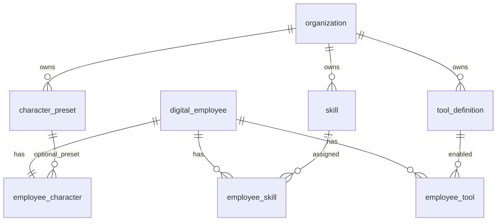

# NULLXES — Agent Brief: Blueprint (Character / Skills / Tools)

**Product:** NULLXES Digital Employees  
**Document date:** 2026-07-05 (`05-07-26`)  
**Audience:** AI coding agents extending **Agent Blueprint** — org-scoped character presets, skill library, tool catalog, and per-employee assignments  
**Repo:** `dplatform`  
**Companion refs:** [`AGENTS.md`](../AGENTS.md), [`AGENT_REFERENCE_2026-06-26.md`](./AGENT_REFERENCE_2026-06-26.md), [`AGENT_TALK_2026-07-05.md`](./AGENT_TALK_2026-07-05.md), [`AGENT_DIGITAL_EMPLOYEES_2026-07-05.md`](./AGENT_DIGITAL_EMPLOYEES_2026-07-05.md), [`PLATFORM_SCOPE.md`](./PLATFORM_SCOPE.md)

Agent Blueprint replaces ad-hoc prompt boxes and hardcoded tool lists with **DB-backed, org-scoped configuration**. Runtime (Talk, Missions) reads only from PostgreSQL after seed — never from inline constants in route handlers.

**Phase A scope (current):** builtin tools only, full CRUD UI, runtime composition. **Not in Phase A:** webhook tools, MCP connectors, Public API scopes for skills/tools.

---

## 1. Product role

Blueprint answers: *How does this digital employee behave, what can they do, and which tools are they allowed to invoke?*

| Layer | Purpose |
|-------|---------|
| **Character preset** | Org or system template defining traits, speech style, boundaries, compiled `prompt_block` |
| **Skill** | Procedure library with instructions, triggers, optional `required_tool_slugs`, compiled `prompt_block` |
| **Tool definition** | Catalog row mirroring OpenAI function schema + risk metadata |
| **Employee assignments** | 1:1 character, N skills (priority + proficiency), N tools (enabled toggle) |

Primary entity remains **`digital_employee`**. Blueprint is configuration hung off employees and organizations — not a separate product surface.

---

## 2. Data architecture



### 2.1 Scoping rule

All reads and writes use **org + system template** scope:

```typescript
// src/features/agent-blueprint/lib/org-blueprint-scope.ts
orgOrSystemScope(organizationId, table.organizationId)
// → organization_id = $org OR organization_id IS NULL (system rows)
```

System templates have `organization_id IS NULL` and `is_system_template = true`. Partial unique indexes enforce slug uniqueness per org and globally for system rows.

### 2.2 Entity files

| Table | Entity path | Migration |
|-------|-------------|-----------|
| `character_preset` | `src/entities/character-preset/` | `drizzle/0030_flashy_pestilence.sql` |
| `employee_character` | `src/entities/employee-character/` | same |
| `skill` | `src/entities/skill/` | same |
| `employee_skill` | `src/entities/employee-skill/` | same |
| `tool_definition` | `src/entities/tool-definition/` | same |
| `employee_tool` | `src/entities/employee-tool/` | same |

Registration: `src/shared/db/drizzle-schema.ts`, `drizzle.config.ts`.

`employee_mission.skill_ids` (uuid array) added in the same migration for mission ↔ skill linkage — see [`AGENT_MISSIONS_2026-07-05.md`](./AGENT_MISSIONS_2026-07-05.md).

---

## 3. Schema reference

### 3.1 `character_preset`

| Column | Type | Notes |
|--------|------|-------|
| `traits` | jsonb | `{ formality, empathy, assertiveness, verbosity }` each 1–5 |
| `speech_style` | jsonb | `{ openingBehavior, closingBehavior, catchphrases[] }` |
| `boundaries` | text | Hard limits for the persona |
| `language_policy` | enum | `ru` \| `en` \| `auto` |
| `prompt_block` | text | **Compiled** — not raw user input |
| `is_system_template` | boolean | Platform seed rows |

Compiler: `src/features/agent-blueprint/lib/compile-character-prompt.ts` → `compileCharacterPromptBlock()`.

### 3.2 `employee_character` (1:1 per employee)

| Column | Notes |
|--------|-------|
| `preset_id` | Optional FK; null = custom-only character |
| `trait_overrides` | Partial override of preset traits |
| `custom_prompt_block` | Freeform addendum |
| `compiled_prompt_block` | Preset + overrides + custom — **runtime reads this** |

Service: `src/features/agent-blueprint/services/upsert-employee-character.ts`.

### 3.3 `skill`

| Column | Notes |
|--------|-------|
| `instructions` | Authoring source for compiler |
| `triggers` | `{ keywords[], intents[] }` — UI keywords today; intents reserved |
| `required_tool_slugs` | Declares tool dependencies (documentation + future enforcement) |
| `category` | `sales` \| `support` \| `legal` \| `ops` \| `custom` |
| `prompt_block` | Compiled procedure block |

Compiler: `src/features/agent-blueprint/lib/compile-skill-prompt.ts`.

### 3.4 `employee_skill`

| Column | Notes |
|--------|-------|
| `proficiency` | `basic` \| `standard` \| `expert` — affects compiled skill block |
| `priority` | Lower = earlier in prompt stack |
| `is_active` | Inactive skills excluded from runtime |

Unique: `(employee_id, skill_id)`.

### 3.5 `tool_definition`

| Column | Notes |
|--------|-------|
| `type` | Phase A: `builtin` only |
| `parameters_schema` | OpenAI function JSON schema |
| `risk_level` | `read` \| `write` \| `destructive` |
| `requires_approval` | Gates destructive/write tools via approval flow |
| `is_active` | Org admin can deactivate org copy |

Builtin schemas sourced from `src/features/agent-tools/lib/tool-definitions.ts`, mapped in `system-catalog.ts`.

### 3.6 `employee_tool`

Unique `(employee_id, tool_definition_id)`. `is_enabled` gates runtime tool slug list.

---

## 4. CRUD surfaces

### 4.1 Settings (org library)

Route: `/settings?tab=characters|skills|tools`  
Page: `src/app/(dashboard)/settings/page.tsx`  
Tabs: `src/features/agent-blueprint/components/agent-blueprint-settings-tabs.tsx`

| Tab | Component | Permission |
|-----|-----------|------------|
| Characters | `settings-characters-tab.tsx` | `canManageOrganization` |
| Skills | `settings-skills-tab.tsx` | `canManageOrganization` |
| Tools | `settings-tools-tab.tsx` | `canManageOrganization` (activate/deactivate org tools) |

### 4.2 Employee detail (per-employee assignment)

Route: `/dashboard/employees/[id]` — tabs **Character**, **Skills**, **Tools**  
Shell: `src/features/employees/components/employee-detail-tabs.tsx`  
Blueprint tabs: `employee-blueprint-tabs.tsx`, `employee-character-tab.tsx`, `employee-skills-tab.tsx`, `employee-tools-tab.tsx`

Permission: `canManageEmployees` for mutations.

### 4.3 Server actions

All in `src/features/agent-blueprint/actions/manage-blueprint.ts`:

| Action | Service |
|--------|---------|
| `createCharacterPresetAction` | `services/create-character-preset.ts` |
| `updateCharacterPresetAction` | same |
| `deleteCharacterPresetAction` | same |
| `duplicateCharacterPresetAction` | same |
| `createSkillAction` / `updateSkillAction` / `deleteSkillAction` | `services/create-skill.ts` |
| `upsertEmployeeCharacterAction` | `services/upsert-employee-character.ts` |
| `assignEmployeeSkillsAction` / `removeEmployeeSkillAction` / `updateEmployeeSkillMetaAction` | `services/assign-employee-skills.ts` |
| `syncEmployeeToolAction` | `services/sync-employee-tools.ts` |
| `setOrganizationToolActiveAction` | `services/sync-employee-tools.ts` |
| `listCharacterPresetsForStudioAction` | used by create wizard |

Revalidation: `/settings` and `/dashboard/employees/[id]` via `revalidateBlueprintPaths()`.

---

## 5. Runtime composition

Runtime never reads raw `traits` or `instructions` — only **compiled blocks** and **enabled slugs**.

### 5.1 Query entry point

`src/features/agent-blueprint/queries/get-employee-blueprint.ts` → `getEmployeeBlueprint()`:

```typescript
{
  characterPromptBlock: string | null,
  activeSkills: Array<{ slug, promptBlock, proficiency }>,
  enabledToolSlugs: string[],
}
```

Auto-seeds system catalog on first read if missing (`seedSystemBlueprintCatalog()`).

### 5.2 Prompt assembly (Talk)

Order in `src/features/runtime-session/services/build-talk-brain-request.ts`:

1. **Global brain wrapper** — `composeShutenTalkSystemPrompt()` when `brainProvider === "nullxes"`, else passthrough
2. **Identity + role** — `composeTalkSystemPrompt()` from `employee_runtime.system_prompt` + name/role/gender
3. **Character block** — `appendCharacterBlock()` from blueprint
4. **Skills block** — `appendSkillsBlock()` — header `Active skills:` then joined `prompt_block`s by priority
5. **RAG** — `formatKnowledgeContext()` when employee has indexed knowledge
6. **Scenario overlay** — optional, from active scenario session

Helpers: `src/features/agent-blueprint/lib/build-blueprint-prompt-blocks.ts`.

### 5.3 Tool gating (Talk)

`enabledToolSlugs` from blueprint → `resolveTalkBrainTools()` in `src/features/runtime-session/lib/resolve-talk-brain-tools.ts`. Latency heuristics in `should-run-talk-tool-loop.ts` — see [`AGENT_TALK_2026-07-05.md`](./AGENT_TALK_2026-07-05.md).

### 5.4 Missions

Mission-specific skills merged via `skill_ids` column — see [`AGENT_MISSIONS_2026-07-05.md`](./AGENT_MISSIONS_2026-07-05.md).

---

## 6. Seed catalog & defaults

### 6.1 System catalog source

`src/features/agent-blueprint/lib/system-catalog.ts`:

| Seed set | Count (approx) | Notes |
|----------|----------------|-------|
| `SYSTEM_CHARACTER_PRESETS` | 4 | `enterprise_closer`, `support_empath`, `legal_cautious`, `ops_operator` |
| `SYSTEM_SKILLS` | 8+ | e.g. `b2b_discovery`, `objection_handling`, `knowledge_first_answer` |
| `SYSTEM_TOOLS` | 9 | Derived from `AGENT_TOOL_DEFINITIONS` with fixed UUIDs |

Seed service: `src/features/agent-blueprint/services/seed-system-blueprint-catalog.ts` — idempotent upsert by fixed UUID.

### 6.2 Default assignment on employee create

`src/features/agent-blueprint/services/apply-default-employee-blueprint.ts`:

- Character preset from `resolveDefaultCharacterPresetSlug(role)` (regex on role string)
- Skills from `resolveDefaultSkillSlugs(role)` + universal skills
- Tools from `DEFAULT_ENABLED_TOOL_SLUGS` (excludes `RESTRICTED_TOOL_SLUGS`: `cancel_mission`, `restart_mission`)

Called from `src/features/employees/actions/create-employee-record.ts` when wizard does not pick a preset.

### 6.3 Backfill script

`scripts/backfill-employee-blueprint-defaults.ts` — npm script `blueprint:backfill`  
Applies defaults to existing employees missing blueprint rows.

---

## 7. Verification

```bash
npm run agent-blueprint:verify
```

Script: `src/features/agent-blueprint/verify-agent-blueprint.ts`

Covers: seed → org preset/skill CRUD → employee create → default blueprint → character upsert → skill assign → `getEmployeeBlueprint()` assertions → cleanup.

After schema changes: `npm run db:generate` → apply migration → re-run verify.

---

## 8. Iteration rules (Blueprint-specific)

From [`AGENTS.md`](../AGENTS.md) anti-neural-slop rules, applied to this domain:

| Rule | Blueprint interpretation |
|------|--------------------------|
| One iteration = one entity + one migration + one verify | Split character / skill / tool if reverting; current branch ships combined `0030` |
| No hypothetical tables | Do not add `webhook_tool_config`, MCP registry, or marketplace tables in Phase A |
| Complete current domain first | Finish CRUD + runtime wiring before Phase B (webhooks, MCP, API scopes) |
| shadcn/ui only | All blueprint tabs use existing shadcn primitives |
| Black & white UI | No category color coding beyond opacity/typography |

**Phase B (explicitly deferred):** custom webhook tools, MCP connector, Public API `skills:read|write` / `tools:read`, skill packs marketplace, character A/B analytics from telemetry.

---

## 9. Agent implementation rules

1. **Read [`AGENTS.md`](../AGENTS.md) + [`AGENT_REFERENCE_2026-06-26.md`](./AGENT_REFERENCE_2026-06-26.md) before coding.**
2. **One entity = one migration = one verify path** — extend `agent-blueprint:verify` or add a focused verify script per new entity.
3. **NULLXES = digital workforce OS; primary entity = `digital_employee`** — blueprint configures employees; it is not a standalone product module.
4. **Brain split: Anam avatar-only, cognition in `/api/talk/brain-stream`** — blueprint affects system prompt and tool list only; never push LLM logic into Anam persona config.
5. **Prompt layers order:** global → character → skills → identity → role → RAG → scenario — do not reorder without updating Talk and mission processors together.
6. **Tools: DB-enabled slugs + latency heuristics; never bypass org scope** — `resolveTalkBrainTools` must intersect heuristics with `employee_tool` + `tool_definition.is_active`.
7. **File map with absolute paths** — start changes in `src/features/agent-blueprint/` and `src/entities/{character-preset,skill,tool-definition,employee-*}/`; wire runtime in `build-talk-brain-request.ts`.
8. **Anti-patterns:** do not duplicate prompt compilers outside `compile-*-prompt.ts`; do not hardcode tool slugs in routes without a matching `tool_definition` row; do not store raw user markdown in `prompt_block` without compilation.

---

## 10. Quick links

| Resource | Path |
|----------|------|
| Agent rules | [`AGENTS.md`](../AGENTS.md) |
| Web technical reference | [`AGENT_REFERENCE_2026-06-26.md`](./AGENT_REFERENCE_2026-06-26.md) |
| Talk runtime brief | [`AGENT_TALK_2026-07-05.md`](./AGENT_TALK_2026-07-05.md) |
| Employee entity brief | [`AGENT_DIGITAL_EMPLOYEES_2026-07-05.md`](./AGENT_DIGITAL_EMPLOYEES_2026-07-05.md) |
| Missions + skill_ids | [`AGENT_MISSIONS_2026-07-05.md`](./AGENT_MISSIONS_2026-07-05.md) |
| System seed catalog | `src/features/agent-blueprint/lib/system-catalog.ts` |
| Seed service | `src/features/agent-blueprint/services/seed-system-blueprint-catalog.ts` |
| Runtime blueprint query | `src/features/agent-blueprint/queries/get-employee-blueprint.ts` |
| Server actions | `src/features/agent-blueprint/actions/manage-blueprint.ts` |
| Verify script | `src/features/agent-blueprint/verify-agent-blueprint.ts` |
| Migration 0030 | `drizzle/0030_flashy_pestilence.sql` |
| OpenAI tool schemas | `src/features/agent-tools/lib/tool-definitions.ts` |

---

*Document version: 2026-07-05. Update when Phase B scope opens or migration numbering changes.*
