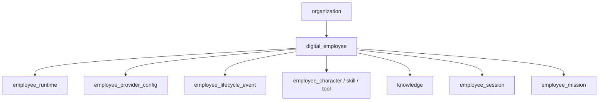

# NULLXES — Agent Brief: Digital Employees

**Product:** NULLXES Digital Employees  
**Document date:** 2026-07-05 (`05-07-26`)  
**Audience:** AI coding agents working on **employee CRUD, studio provisioning, lifecycle, and blueprint assignment**  
**Repo:** `dplatform`  
**Companion refs:** [`AGENTS.md`](../AGENTS.md), [`AGENT_REFERENCE_2026-06-26.md`](./AGENT_REFERENCE_2026-06-26.md), [`AGENT_BLUEPRINT_2026-07-05.md`](./AGENT_BLUEPRINT_2026-07-05.md), [`AGENT_TALK_2026-07-05.md`](./AGENT_TALK_2026-07-05.md), [`PLATFORM_SCOPE.md`](./PLATFORM_SCOPE.md)

The **digital employee** is the primary entity of the platform. Every feature — Talk, Missions, HQ, Analytics — hangs off this record. Agents must treat employee creation, provisioning, and lifecycle as the core domain, not a settings sidebar.

---

## 1. Entity model

### 1.1 Core table: `digital_employee`

Schema: `src/entities/digital-employee/schema.ts`

| Column | Type | Notes |
|--------|------|-------|
| `name` | text | Display name |
| `role` | text | Job title — drives default blueprint matching |
| `department` | text | Optional grouping for roster / HQ |
| `description` | text | Optional |
| `status` | enum | `draft` \| `active` \| `paused` \| `archived` |
| `avatar_provider` | enum | `anam` \| `nullxes` \| `custom` — wizard creates `anam` |
| `brain_provider` | enum | `openai` \| `anthropic` \| `google` \| `nullxes` |

### 1.2 Satellite tables (1:1 or 1:N)

| Table | Cardinality | Purpose | Entity path |
|-------|-------------|---------|-------------|
| `employee_runtime` | 1:1 | System prompt, temperature, max tokens, session limit | `src/entities/runtime/schema.ts` |
| `employee_provider_config` | 1:N (avatar, brain, session) | Provisioning JSON + status per provider | `src/entities/provider-config/schema.ts` |
| `employee_lifecycle_event` | 1:N | Audit trail of status/runtime changes | `src/entities/employee-lifecycle/schema.ts` |
| `employee_character` | 1:1 | Blueprint character assignment | `src/entities/employee-character/schema.ts` |
| `employee_skill` | 1:N | Blueprint skill assignments | `src/entities/employee-skill/schema.ts` |
| `employee_tool` | 1:N | Blueprint tool toggles | `src/entities/employee-tool/schema.ts` |
| `knowledge_source` / chunks | 1:N | RAG corpus for Talk | `src/entities/knowledge/` |
| `employee_session` | 1:N | Talk session history | `src/entities/session/schema.ts` |
| `employee_mission` | 1:N | Async work assignments | `src/entities/employee-mission/schema.ts` |

### 1.3 Relationship diagram

---

## 2. Status lifecycle

### 2.1 Status enum

| Status | Meaning | Typical next |
|--------|---------|--------------|
| `draft` | Created, provisioning may be pending | `active` after studio complete |
| `active` | Operational — Talk and missions allowed | `paused` or `archived` |
| `paused` | Temporarily disabled | `active` |
| `archived` | Soft-deleted from roster filters | restore → `active` |

Status stored on `digital_employee.status`. Lifecycle events recorded separately for audit UI.

### 2.2 Lifecycle events

Schema: `src/entities/employee-lifecycle/schema.ts`  
Event types: `created`, `activated`, `paused`, `archived`, `runtime_updated`, `knowledge_updated`

Service: `src/features/employee/services/record-lifecycle-event.ts`

Employee detail **Lifecycle** tab shows chronological events with actor and reason metadata.

### 2.3 Provisioning readiness

Separate from `status`: each `employee_provider_config` row carries `provisioningStatus` in JSON config:

| Value | UI meaning |
|-------|------------|
| `pending` | Inngest job queued or running |
| `ready` | Provider resource live — Talk can start |
| `failed` | Show error; block Talk if avatar/brain/session critical |

Verify path: `npm run provider-provisioning:verify` (see AGENT_REFERENCE).

---

## 3. Create wizard (studio flow)

### 3.1 Entry points

| Surface | Path / component |
|---------|------------------|
| Roster CTA | `/dashboard/employees` → **New Digital Employee** |
| Dialog | `src/features/employees/create/create-employee-dialog.tsx` |
| Server create | `src/features/employees/actions/create-employee-record.ts` |

### 3.2 Wizard steps

Defined in `src/features/employees/create/constants.ts` and `wizard-persistence.ts`:

| Step | Key | Collects |
|------|-----|----------|
| 1 | `identity` | Name, role, department |
| 2 | `avatar` | Anam preset or photo upload |
| 3 | `voice` | Studio voice selection (required) |
| 4 | `character` | Optional character preset from org library |
| 5 | `brain` | Provider + model (or org default) |
| 6 | `knowledge` | Draft knowledge items |
| 7 | `summary` | Review + submit |

Draft persisted in `sessionStorage` key `nullxes.create-employee-wizard.v1`.

Intake normalization: `src/features/employees/create/wizard-intake.ts`  
Types: `src/features/employees/create/types.ts`

### 3.3 Transaction on submit

`createEmployeeRecord()` runs a DB transaction:

1. Insert `digital_employee` (`status: draft`)
2. Insert `employee_runtime` with `buildEmployeeSystemPrompt(name, role)`
3. Record lifecycle event `created`
4. Insert three `employee_provider_config` rows: avatar, brain, session (voice)
5. After commit: persist knowledge drafts if any
6. Apply blueprint: `upsertEmployeeCharacter` if preset chosen, else `applyDefaultEmployeeBlueprint({ role })`
7. Audit event `employee.created`
8. Revalidate `/dashboard/employees`

Inngest provisioning jobs are triggered separately when employee moves to active / studio completes — not inside the initial insert transaction.

### 3.4 Plan limits

Enforced in create action:

- `assertCanCreateEmployee()` — billing plan employee cap
- `assertAvatarStudioSelection()` — custom photo vs preset by plan
- `getSessionLimitSecondsForPlan()` — written to `employee_runtime.session_limit_seconds`

Billing: `src/features/billing/services/check-plan-limits.ts`

---

## 4. Employee detail (post-create studio)

Route: `/dashboard/employees/[id]`  
Screen: `src/features/employees/components/employee-detail-screen.tsx`  
Tabs: `src/features/employees/components/employee-detail-tabs.tsx`

| Tab | Feature module | Purpose |
|-----|----------------|---------|
| Overview | `features/employees` | Summary, status, quick actions |
| Avatar | studio / provisioning | Anam persona, preview |
| Voice | studio | ElevenLabs / session voice |
| Brain | runtime | System prompt editor, temperature, model |
| Knowledge | `features/knowledge-processing` | Sources, indexing status |
| Tasks | `features/tasks` or HQ linkage | Operational tasks |
| Lifecycle | `features/employee` | Event timeline |
| Character | `features/agent-blueprint` | Preset + trait overrides |
| Skills | `features/agent-blueprint` | Assign org skills, priority, proficiency |
| Tools | `features/agent-blueprint` | Enable/disable tool slugs |

Blueprint tabs documented in [`AGENT_BLUEPRINT_2026-07-05.md`](./AGENT_BLUEPRINT_2026-07-05.md).

---

## 5. System prompt vs blueprint

Two layers coexist by design:

| Source | Field | Content |
|--------|-------|---------|
| Studio / Brain tab | `employee_runtime.system_prompt` | Identity, role instructions, org defaults |
| Blueprint Character tab | `employee_character.compiled_prompt_block` | Traits, speech style, boundaries |

At Talk runtime, `composeTalkSystemPrompt()` builds identity from runtime, then blueprint blocks append — see [`AGENT_TALK_2026-07-05.md`](./AGENT_TALK_2026-07-05.md) §3.

Do not merge these in the DB; keep studio prompt editable independently of character preset.

---

## 6. Public API exposure

Read/write via `/api/v1/employees` (API key scopes `employees:read|write`).  
Public API returns core employee fields — **not** full blueprint graph. Integrators use platform UI or future blueprint API scopes (Phase B).

Sessions: `/api/v1/sessions` for Talk history metadata.

OpenAPI: `public/openapi.yaml` → `GET /api/docs`

---

## 7. Verification & scripts

| Script | Command | Validates |
|--------|---------|-----------|
| Employee domain | `npm run employee:verify` | CRUD + lifecycle |
| Provider provisioning | `npm run provider-provisioning:verify` | Avatar/brain/voice ready paths |
| Agent blueprint | `npm run agent-blueprint:verify` | Default blueprint on create |
| Backfill blueprint | `npm run blueprint:backfill` | Existing employees missing blueprint rows |

---

## 8. Agent implementation rules

1. **Read [`AGENTS.md`](../AGENTS.md) + [`AGENT_REFERENCE_2026-06-26.md`](./AGENT_REFERENCE_2026-06-26.md) before coding.**
2. **One entity = one migration = one verify path** — employee schema changes get their own migration + `employee:verify` extension.
3. **NULLXES = digital workforce OS; primary entity = `digital_employee`** — every new feature asks “which employee does this attach to?” first.
4. **Brain split: Anam avatar-only, cognition in `/api/talk/brain-stream`** — employee brain config selects provider/model; it does not embed Anam LLM persona.
5. **Prompt layers order:** global → character → skills → identity → role → RAG → scenario — runtime prompt from `employee_runtime` is the identity/role layer; do not collapse blueprint into it silently.
6. **Tools: DB-enabled slugs + latency heuristics; never bypass org scope** — default tools applied in `apply-default-employee-blueprint.ts`, not in create wizard UI alone.
7. **File map with absolute paths** — employee UI in `src/features/employees/`; lifecycle in `src/features/employee/`; create flow in `src/features/employees/create/`; entities in `src/entities/digital-employee/`.
8. **Anti-patterns:** do not create employees without `employee_runtime`; do not skip lifecycle events on status changes; do not duplicate blueprint defaults in wizard without calling shared services.

---

## 9. Quick links

| Resource | Path |
|----------|------|
| Agent rules | [`AGENTS.md`](../AGENTS.md) |
| Web technical reference | [`AGENT_REFERENCE_2026-06-26.md`](./AGENT_REFERENCE_2026-06-26.md) |
| Blueprint brief | [`AGENT_BLUEPRINT_2026-07-05.md`](./AGENT_BLUEPRINT_2026-07-05.md) |
| Talk brief | [`AGENT_TALK_2026-07-05.md`](./AGENT_TALK_2026-07-05.md) |
| Digital employee schema | `src/entities/digital-employee/schema.ts` |
| Runtime schema | `src/entities/runtime/schema.ts` |
| Create wizard dialog | `src/features/employees/create/create-employee-dialog.tsx` |
| Create server action | `src/features/employees/actions/create-employee-record.ts` |
| Default blueprint apply | `src/features/agent-blueprint/services/apply-default-employee-blueprint.ts` |
| Employee detail screen | `src/features/employees/components/employee-detail-screen.tsx` |
| System prompt builder | `src/features/employees/lib/build-system-prompt.ts` |
| Lifecycle events | `src/features/employee/services/record-lifecycle-event.ts` |
| Roster route | `src/app/(dashboard)/dashboard/employees/page.tsx` |

---

*Document version: 2026-07-05. Update when wizard steps or lifecycle states change.*
