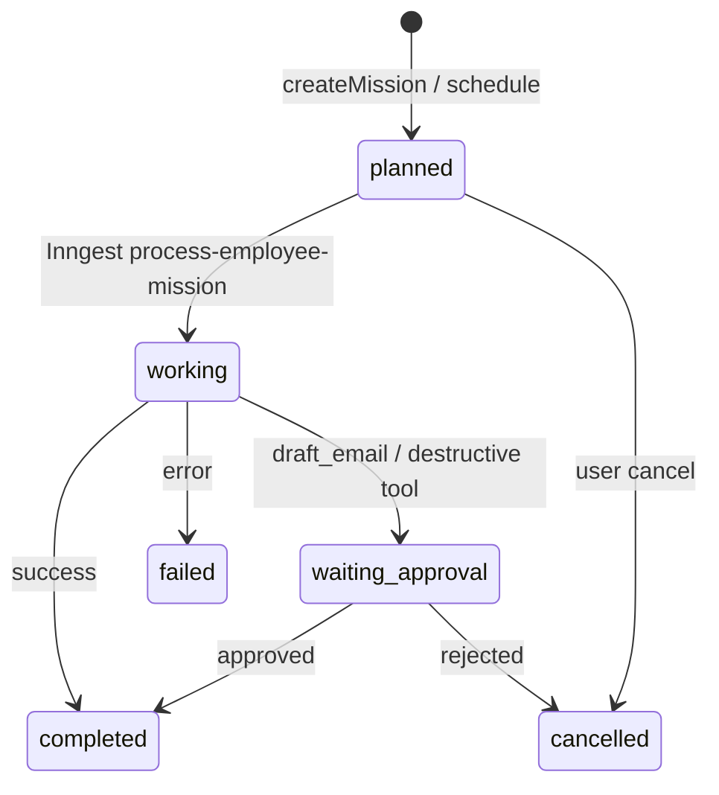

# NULLXES — Agent Brief: Missions

**Product:** NULLXES Digital Employees  
**Document date:** 2026-07-05 (patched 2026-07-09: mission types `prospecting_en` / `investor_base`)  
**Audience:** AI coding agents working on **employee missions, schedules, skill linkage, and Inngest workers**  
**Repo:** `dplatform`  
**Companion refs:** [`AGENTS.md`](../AGENTS.md), [`AGENT_REFERENCE_2026-06-26.md`](./AGENT_REFERENCE_2026-06-26.md), [`AGENT_BLUEPRINT_2026-07-05.md`](./AGENT_BLUEPRINT_2026-07-05.md), [`AGENT_TALK_2026-07-05.md`](./AGENT_TALK_2026-07-05.md), [`PLATFORM_SCOPE.md`](./PLATFORM_SCOPE.md)

Missions are **async work assignments** for digital employees — prospecting research, custom briefs, scheduled runs. They reuse the same brain stack as Talk (`buildTalkBrainRequest`) but operate in batch / extraction mode inside Inngest, not live NDJSON streaming.

---

## 1. Core entities

### 1.1 `employee_mission`

Schema: `src/entities/employee-mission/schema.ts`

| Column | Type | Notes |
|--------|------|-------|
| `title` | text | Display name |
| `goal` | text | Optional high-level objective |
| `brief` | text | Primary instruction body |
| `skills` | jsonb string[] | **Legacy labels** — human-readable skill names |
| `skill_ids` | uuid[] | **Blueprint linkage** — FK ids into `skill` table |
| `type` | enum | `prospecting` \| `prospecting_en` \| `investor_base` \| `custom` (migration `0031`) |
| `source` | enum | `manual` \| `scheduled` |
| `schedule_id` | uuid | Set when spawned from `mission_schedule` |
| `status` | enum | See §2 |
| `plan` | text | Agent-generated execution plan |
| `evidence` | jsonb | Research artifacts |
| `leads` | jsonb | Prospecting output (verified contacts) |
| `handoffs` | jsonb | Workforce handoff records |
| `timeline` | jsonb | Step log for UI |
| `error_message` | text | Failure reason |
| `completed_at` | timestamp | Set on terminal success |

Migration adding `skill_ids`: `drizzle/0030_flashy_pestilence.sql`.

### 1.2 `mission_schedule`

Schema: `src/entities/mission-schedule/schema.ts`

| Column | Default | Notes |
|--------|---------|-------|
| `type` | `prospecting` | Mission type to spawn |
| `title` | — | Schedule display name |
| `brief` | — | Passed to created mission |
| `cron_expression` | `0 6 * * *` | Daily 06:00 trigger (interpreted by Inngest cron) |
| `timezone` | `Europe/Moscow` | Dedup "already ran today" logic |
| `enabled` | true | Admin toggle |
| `last_run_at` | null | Updated after successful spawn |

---

## 2. Mission lifecycle

### 2.1 Status enum

| Status | Meaning |
|--------|---------|
| `planned` | Created, queued for Inngest |
| `working` | Processor running |
| `waiting_approval` | Output needs human approval (e.g. outbound draft) |
| `completed` | Success |
| `failed` | Error — see `error_message` |
| `cancelled` | User or system cancelled |

Timeline steps appended via `src/features/missions/lib/append-mission-timeline-step.ts`.

### 2.2 Flow diagram



---

## 3. Creating missions

### 3.1 Server action

`src/features/missions/actions/create-mission.ts` → `createMissionAction()`

Permission: `canOperateEmployees`

Input:

| Field | Notes |
|-------|-------|
| `employeeId` | Required |
| `type` | `prospecting` \| `custom` |
| `title`, `goal`, `brief` | Brief required; prospecting defaults from `prospecting-defaults.ts` |
| `skills` | Comma-separated string → `parseMissionSkills()` → `skills` jsonb |
| `skillIds` | Optional uuid[] → `skill_ids` column |

Service: `src/features/missions/services/create-employee-mission.ts`

After insert → `enqueueEmployeeMission()` sends Inngest event.

### 3.2 skill_ids linkage

Two parallel fields intentionally coexist:

| Field | Purpose |
|-------|---------|
| `skills` (string[]) | Display labels in UI, legacy mission forms |
| `skill_ids` (uuid[]) | Resolved to `skill.prompt_block` at execution time |

Resolver: `src/features/missions/lib/resolve-mission-skill-prompts.ts`

```typescript
resolveMissionSkillPromptBlocks(skillIds: string[]): Promise<string[]>
// SELECT prompt_block FROM skill WHERE id IN (...)
```

Merger: `src/features/missions/lib/build-mission-execution-context.ts`

```typescript
buildMissionExecutionContext({
  brief, goal, skills, skillPromptBlocks
})
// → "Mission goal: …\nMission brief: …\nRequired skills: …\nSkill procedures:\n…"
```

Mission processor prepends this context to brain user messages — **in addition to** employee Talk system prompt from `buildTalkBrainRequest()`.

When adding mission UI skill pickers, write **`skill_ids`** from org skill library (`list-organization-skills.ts`), not free-text only.

---

## 4. Inngest workers

### 4.1 Process mission

`src/inngest/functions/process-employee-mission.ts`

Event: `process-employee-mission-started` (see file for exact payload)

Prospecting pipeline (simplified):

1. Load mission + employee
2. `resolveMissionSkillPromptBlocks(mission.skillIds)`
3. `buildMissionExecutionContext(...)`
4. Web research via `researchMissionProspects()`
5. `buildTalkBrainRequest()` for lead extraction (data-extraction mode system prompt overlay)
6. `collectTalkBrainResponse()` — full text, not stream
7. Parse JSON leads → `filterVerifiedMissionLeads()`
8. Update mission `leads`, `evidence`, `timeline`, `status`
9. Optional digest email via `sendMissionContactsDigestEmail()`
10. `recordWorkEvent()` for audit

Uses same brain providers and blueprint layers as Talk — see [`AGENT_TALK_2026-07-05.md`](./AGENT_TALK_2026-07-05.md).

### 4.2 Scheduled runs

`src/inngest/functions/run-mission-schedules.ts`  
Service: `src/features/missions/services/run-due-mission-schedules.ts`

Cron worker:

1. `ensureDefaultYukiSchedulesForAllOrganizations()` — bootstrap default prospecting schedule for demo employee
2. Load all `mission_schedule` where `enabled = true`
3. Skip if `lastRunAt` is same calendar day in schedule timezone
4. Skip if active mission already exists today for that schedule
5. `createEmployeeMission({ source: "scheduled", scheduleId })`
6. `enqueueEmployeeMission()`
7. Update `last_run_at`

Timezone helpers: `startOfDayInTimezone()`, `isSameCalendarDayInTimezone()` in same file.

### 4.3 Outbound + handoff

| Function | File | Role |
|----------|------|------|
| `sendMissionOutboundOnApprove` | `src/inngest/functions/send-mission-outbound.ts` | Send approved outbound after human approval |
| `processMissionHandoffStart` | `src/inngest/functions/process-mission-handoff.ts` | Start workforce handoff from mission leads |

All four mission functions are registered in `src/app/api/inngest/route.ts`.

---

## 5. Talk tools ↔ missions

Mission-related builtin tools (from blueprint catalog):

| Slug | Risk | Notes |
|------|------|-------|
| `list_missions` | read | Talk tool — list employee missions |
| `cancel_mission` | destructive | Requires approval; not in default enable list |
| `restart_mission` | destructive | Requires approval |
| `draft_email` | write | Prospecting approval flow |

Definitions: `src/features/agent-tools/lib/tool-definitions.ts`  
Approval entity: `src/entities/agent-approval/schema.ts`

Talk gating applies — tools only when user message matches heuristics AND slug enabled on employee.

---

## 6. UI surfaces

| Surface | Path | Module |
|---------|------|--------|
| Missions dashboard | `/dashboard/missions` | `src/features/missions/` |
| Employee tasks tab | `/dashboard/employees/[id]` (tasks tab) | mission list per employee |
| Mission detail | missions feature components | timeline, leads, evidence |

i18n keys under `src/i18n/messages/en.json` → `missions.*`

---

## 7. Verification

No dedicated `missions:verify` script yet — validate via:

1. Create mission from UI or `createMissionAction`
2. Confirm Inngest dev processes event (`npm run inngest:dev`)
3. Inspect `employee_mission.timeline` and terminal status
4. For schedules: trigger `run-mission-schedules` Inngest function manually

Regression: prospecting must reject leads without verified `contactEmail` + `contactSourceUrl` (see extraction rules in processor).

---

## 8. Agent implementation rules

1. **Read [`AGENTS.md`](../AGENTS.md) + [`AGENT_REFERENCE_2026-06-26.md`](./AGENT_REFERENCE_2026-06-26.md) before coding.**
2. **One entity = one migration = one verify path** — new mission columns get one migration; extend processor tests or add `missions:verify` when schema stabilizes.
3. **NULLXES = digital workforce OS; primary entity = `digital_employee`** — every mission row requires `employee_id` + org scope.
4. **Brain split: Anam avatar-only, cognition in `/api/talk/brain-stream`** — missions use `buildTalkBrainRequest` / `collectTalkBrainResponse`, not Anam; no avatar in batch path.
5. **Prompt layers order:** global → character → skills → identity → role → RAG → scenario — mission context appends **after** full Talk system prompt, not instead of it.
6. **Tools: DB-enabled slugs + latency heuristics; never bypass org scope** — mission tools (`cancel_mission`, etc.) must respect `tool_definition.requires_approval` and employee enablement.
7. **File map with absolute paths** — schema: `src/entities/employee-mission/schema.ts`; create: `src/features/missions/services/create-employee-mission.ts`; processor: `src/inngest/functions/process-employee-mission.ts`; schedules: `src/features/missions/services/run-due-mission-schedules.ts`.
8. **Anti-patterns:** do not store skill procedures only in `skills` string[] — always populate `skill_ids` when blueprint skills selected; do not guess contact emails in prospecting; do not bypass approval for `draft_email` sends.

---

## 9. Quick links

| Resource | Path |
|----------|------|
| Agent rules | [`AGENTS.md`](../AGENTS.md) |
| Web technical reference | [`AGENT_REFERENCE_2026-06-26.md`](./AGENT_REFERENCE_2026-06-26.md) |
| Blueprint / skills | [`AGENT_BLUEPRINT_2026-07-05.md`](./AGENT_BLUEPRINT_2026-07-05.md) |
| Talk brain build | [`AGENT_TALK_2026-07-05.md`](./AGENT_TALK_2026-07-05.md) |
| Mission schema | `src/entities/employee-mission/schema.ts` |
| Schedule schema | `src/entities/mission-schedule/schema.ts` |
| Create action | `src/features/missions/actions/create-mission.ts` |
| Create service | `src/features/missions/services/create-employee-mission.ts` |
| Skill prompt resolver | `src/features/missions/lib/resolve-mission-skill-prompts.ts` |
| Execution context | `src/features/missions/lib/build-mission-execution-context.ts` |
| Inngest processor | `src/inngest/functions/process-employee-mission.ts` |
| Schedule runner | `src/inngest/functions/run-mission-schedules.ts` |
| Schedule service | `src/features/missions/services/run-due-mission-schedules.ts` |
| Default Yuki schedule | `src/features/missions/services/ensure-default-yuki-schedule.ts` |
| Migration 0030 (skill_ids) | `drizzle/0030_flashy_pestilence.sql` |

---

*Document version: 2026-07-05. Update when mission types, schedule cron, or skill_ids UI change.*
