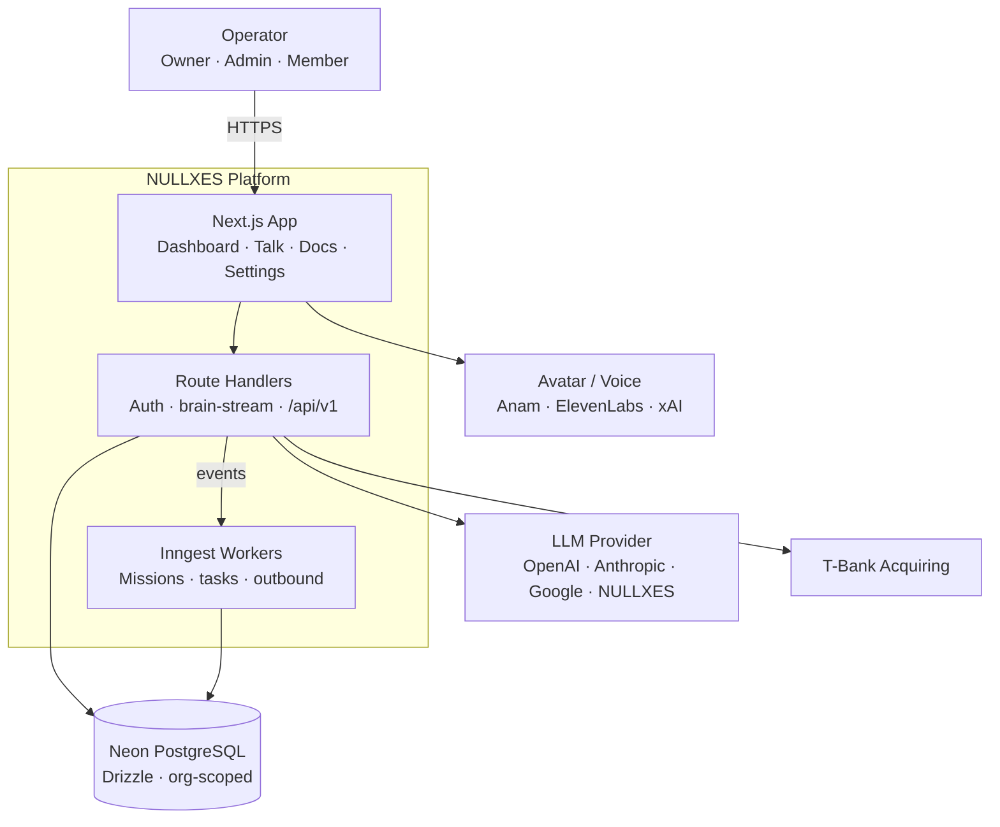
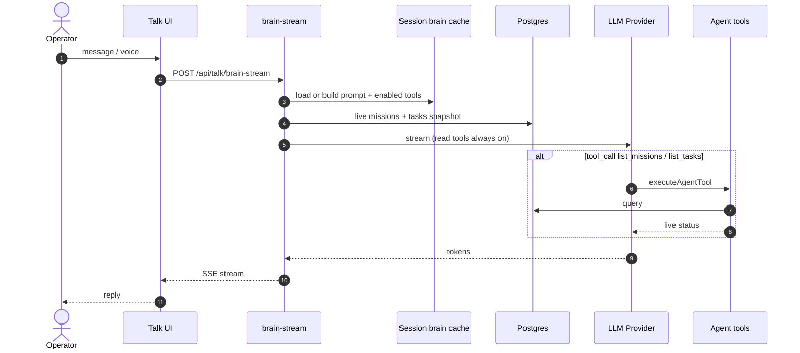
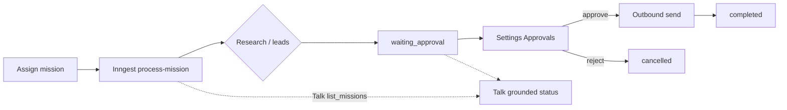
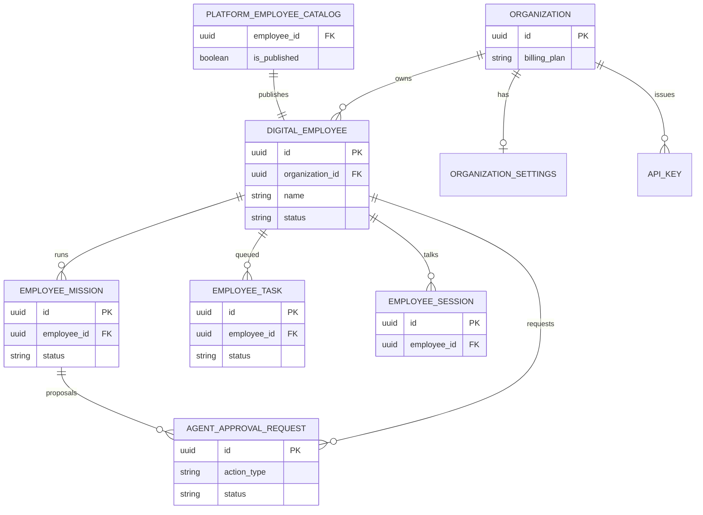

# NULLXES Architecture (Mermaid)

Source of truth for Cursor / agents. Live render: `/docs/architecture`.

Diagram sources are mirrored in `src/app/docs/_lib/architecture-diagrams.ts`.

## C4 — Containers

## Talk — sequence

## Missions — flow

## ERD — core

## Update policy

When changing Talk tools, mission lifecycle, catalog listing, or core schema:
1. Update `src/app/docs/_lib/architecture-diagrams.ts`
2. Mirror the same Mermaid blocks in this file
3. Confirm render on `/docs/architecture`
