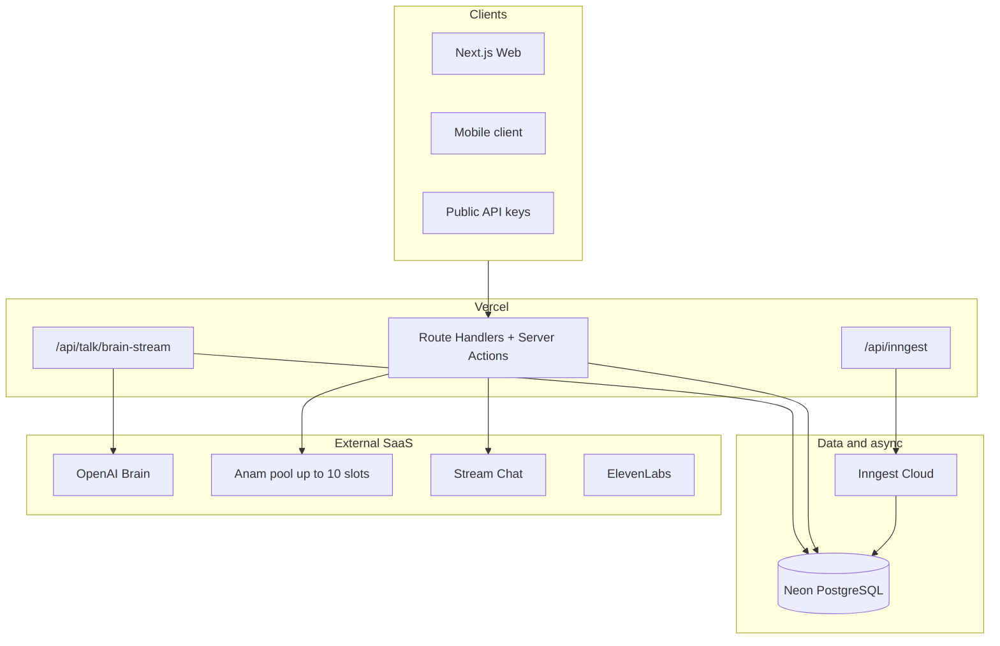
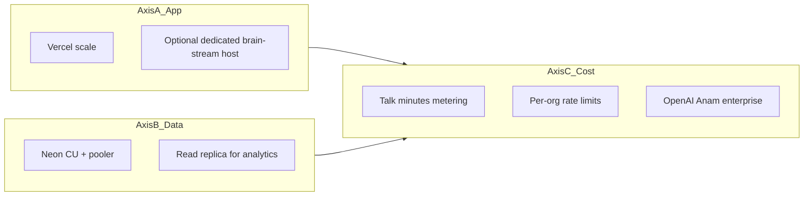

# NULLXES — Scaling Guide (10 → 100 → 1000+)

**Product:** NULLXES Digital Employees  
**Document date:** 2026-07-04  
**Audience:** Engineering, DevOps, product  
**Companion:** [`AGENT_REFERENCE_2026-06-26.md`](./AGENT_REFERENCE_2026-06-26.md), [`DEPLOYMENT_RF.md`](./DEPLOYMENT_RF.md)

This guide describes how to scale the platform without rewriting the architecture until thousands of active organizations. The stack is **serverless-first**: Vercel + Neon + Inngest + external SaaS (Anam, OpenAI, Stream, ElevenLabs).

---

## 1. Architecture baseline

### Key platform files

| Area | Path | Notes |
|------|------|--------|
| DB (HTTP) | `src/shared/db/client.ts` | neon-http Drizzle — default for serverless |
| DB (pool) | `src/shared/db/pool-client.ts` | Transactions / heavier writes |
| Rate limit | `src/shared/security/rate-limit.ts` | In-memory per instance (Redis/Upstash removed) |
| Brain rate limit | `src/features/runtime-session/lib/brain-stream-rate-limit.ts` | 40 req/min per `userId:employeeId` |
| Anam pool | `src/shared/config/anam-api-pool.ts` | `ANAM_API_KEY` … `ANAM_API_KEY_11` |
| Billing limits | `src/features/billing/config/plans.ts` | 6 plans; session + Talk minutes/month + API access |
| Talk SLA | `src/features/runtime-session/lib/talk-sla.ts` | `TALK_SLA_MODE` observe / enforce |
| Background jobs | `src/inngest/functions/` | Knowledge, missions, export, retention |

**Conclusion:** Up to ~1000 orgs, do **not** split into microservices. Bottlenecks are **Talk (LLM + Anam cost/concurrency)**, **Neon latency**, and **provider quotas** — not raw server CPU.

---

## 2. Bottleneck map

| Component | Scales easily? | Why |
|-----------|----------------|-----|
| HTTP CRUD, auth, settings | Yes | Stateless Vercel functions |
| Inngest jobs | Yes (with concurrency limits) | Offloaded from request path |
| Stream Chat | Yes (SaaS plan) | No self-hosted chat server |
| Public API `/api/v1` | Mostly | Rate limits + DB reads |
| **Talk brain-stream** | Partially | Long-lived streams, OpenAI $, optional RAG |
| **RAG per turn** | Expensive | Embedding + pgvector every turn when knowledge exists |
| **Anam live avatar** | Quota-bound | Concurrent streams per lab account |
| **ElevenLabs voice** | Latency + $ | Full reply before TTS |
| **Custom avatar provisioning** | Slot-bound | Anam persona/avatar limits per key |
| Analytics dashboards | Read-heavy | May need replica at scale |

---

## 3. Scaling tiers

### Tier 1 — ~10 users (early / MVP)

**Profile:** 1–3 organizations, occasional Talk, little knowledge.

| Area | Sufficient | Verify |
|------|------------|--------|
| Vercel + Neon | Hobby/Pro, single `DATABASE_URL` | `GET /api/health/db` → `{"ok":true}` |
| Anam | 1–2 keys in pool | `npm run providers:status` |
| Observability | `TALK_SLA_MODE=observe`, Sentry | Vercel logs: `talk.sla.*` |
| Rate limit | In-memory per instance | Soft caps only |

**Actions:** Monitoring and env hygiene only. Do not copy `NGROK_URL`, `INNGEST_DEV=1`, or localhost auth URLs to production ([`DEPLOYMENT_RF.md`](./DEPLOYMENT_RF.md)).

**Code changes:** None required.

---

### Tier 2 — ~100 users

**Profile:** Dozens of orgs, evening Talk peaks, regular Stream chat, knowledge ingest.

#### Infrastructure (ops, no refactor)

| Priority | Action |
|----------|--------|
| P0 | **Neon compute tier up**; Neon region aligned with Vercel function region |
| P1 | Verify Anam pool via `providers:status` / admin; monitor 429 / quota errors |
| P1 | Inngest: review concurrency on `knowledge-ingestion`, `process-employee-mission` |
| P2 | After 1 week of `TALK_SLA_MODE=observe`, switch to `enforce` + Sentry alert |

#### Product limits (already in code — enforce policy)

From `src/features/billing/config/plans.ts`:

| Plan (UI) | Employees | Talk session | Talk min/mo | Knowledge chunks | API | List price |
|-----------|-----------|--------------|-------------|------------------|-----|------------|
| Evaluation | 1 | 120 s | 30 | 5 000 | none | $0 |
| Studio | 1 | 600 s | 180 | 15 000 | none | $49 / mo |
| Team (`operator`) | 3 | 1 200 s | 600 | 50 000 | read | $200 / mo |
| Scale | 10 | 1 800 s | 2 000 | 150 000 | full | $600 / mo |
| enterprise | ∞ | ∞ | ∞ | 100 000 | full | Sales |
| government | ∞ | ∞ | ∞ | ∞ | full | Sales |

**Already enforced in code** (do not re-implement as “future”):

- Concurrent Talk sessions per org — still optional Phase C
- Talk minutes / month metering — **Implemented** (`assertTalkMinutesBudget`)
- Per-org API rate limit key — still optional Phase C

**Future code (only if metrics show abuse)** — see [Phase C](#8-phase-c-future-code-by-metrics):

- Concurrent Talk sessions per org
- Per-org API rate limit key

#### Database (only if SLA breaches on `talk.brain.build` / `talk.brain.rag`)

- Indexes: `employee_session(organization_id, created_at)`, `knowledge_source(employee_id, status)`
- Heavy transactions → `pool-client.ts`
- Analytics read path → defer to read replica (Tier 3)

---

### Tier 3 — ~1000+ users

**Profile:** Hundreds of orgs, tens of concurrent Talk sessions, API integrations, heavy RAG.

#### Three scaling axes

| Axis | Trigger | Solution |
|------|---------|----------|
| **App** | Vercel timeout/memory on streaming | Move only `src/app/api/talk/brain-stream/route.ts` to Fly/Railway/Cloud Run (same code) |
| **Data** | Slow analytics/dashboard | Neon read replica; connection pooler for write spikes |
| **Cost** | Power users erode margin | Talk minute metering, RAG on paid tiers, Inngest queue priority |

#### External providers

| Provider | Bottleneck | Action |
|----------|------------|--------|
| OpenAI | TTFT, cost, RPM | Org-level keys; model tiering (gpt-4o vs mini) |
| Anam | Concurrent streams | Enterprise contract; do not rely on 11 lab slots alone |
| ElevenLabs | Latency + cost | Prefer `voiceMode=anam` where quality allows |
| xAI | Voice session quota | `XAI_API_KEY`; monitor Grok Voice usage |
| Stream | MAU pricing | Plan upgrade |
| Neon | CU, storage | Scale compute; archive old session rows |

#### RU market (separate cell)

Not “scale global” — deploy a **RU cell**:

- Neon in RF-approved region
- `DEPLOYMENT_REGION=ru`, `organization.data_region=ru`
- Foreign processor blocks: `src/features/privacy/services/assert-foreign-data-processing.ts`
- Optional RU reverse-proxy — deferred until regulatory track completes ([`DEPLOYMENT_RF.md`](./DEPLOYMENT_RF.md))

---

### Tier 4 — 10,000+ (future reference only)

- Multi-region cells (US/EU + RU)
- CQRS: OLTP Neon + analytics warehouse
- Cell-based tenancy for large enterprise
- Dedicated Talk edge closer to Anam/OpenAI

**No implementation planned now.** Revisit when Tier 3 signals are sustained.

---

## 4. Transition triggers

| Signal | Threshold | Next step |
|--------|-----------|-----------|
| `talk.sla.breach` rate | >5% of turns per day | Neon region/CU, OpenAI tier, Anam slots |
| Anam 429 / quota errors | Regular occurrence | Enterprise / more slots |
| Inngest backlog | >15 min lag | Concurrency tuning + plan upgrade |
| Neon CPU | Sustained >70% | Scale compute |
| Vercel `brain-stream` 504 | Appearing in logs | Dedicated stream host |
| Talk COGS | >30% of revenue | Billing meters + hard caps |

---

## 5. Monitoring signals

| Signal | Where | Purpose |
|--------|-------|---------|
| `talk.sla.breach` | Vercel logs | Latency regression |
| `talk.sla.observe_breach` | Vercel logs (`TALK_SLA_MODE=observe`) | Calibration before enforce |
| `talk.sla.sample` | Vercel logs | 1% healthy baseline |
| `talk.brain_stream` | Sentry Performance | End-to-end API span |
| `GET /api/health/db` | Uptime monitor | Neon connectivity |
| Inngest failed runs | Inngest dashboard | Background job health |
| Anam rate limit | App logs / `anam-api-pool` | Slot exhaustion |

### Talk SLA environment

| Variable | Values | Default (prod) |
|----------|--------|----------------|
| `TALK_SLA_MODE` | `off` \| `observe` \| `enforce` | `observe` |
| `TALK_PERF_LOG` | `1` for verbose debug | off |

Thresholds: `src/features/runtime-session/lib/talk-sla.ts`

---

## 6. Operations checklist

Run these in **Vercel** and **Neon** dashboards. No application code required.

### P0 — Before ~100 users

- [ ] **Neon region** — match Vercel function region (e.g. `iad1` ↔ `us-east-1`).
- [ ] **Neon compute** — scale CU if connection latency or CPU alerts appear.
- [ ] **Anam pool** — keys already in Vercel (`ANAM_API_KEY` … `ANAM_API_KEY_11`); verify pool health with `npm run providers:status` and admin Anam pool view.
- [ ] **Redeploy** after env changes.

### P1 — SLA rollout (~1 week observe)

- [ ] Set `TALK_SLA_MODE=observe` in production (default if unset in prod code).
- [ ] Run Talk sessions; collect `talk.sla.observe_breach` and `talk.sla.sample` in Vercel logs.
- [ ] Tune thresholds in `talk-sla.ts` only if p95 consistently differs by >20% from targets.
- [ ] Set `TALK_SLA_MODE=enforce`.
- [ ] **Sentry** — alert on message `Talk SLA breach:` (warning level) or filter `talk_sla_span` tag.
- [ ] Optional: `TALK_PERF_LOG=1` on staging only for deep debugging.

### P2 — Inngest at scale

- [ ] Confirm functions registered at `https://<domain>/api/inngest`
- [ ] Review concurrency for: `knowledge-ingestion-process-source`, `process-employee-mission`, `export-job-process`
- [ ] Monitor failed runs and queue depth in Inngest Cloud

---

## 7. Product levers (cost control)

Billing limits are the primary scaling lever for **margin**, not infra size.

| Lever | Status | Location |
|-------|--------|----------|
| Max employees per plan | Implemented | `plans.ts` → `check-plan-limits.ts` |
| Talk session duration cap | Implemented | `sessionLimitSeconds` (free = 120s … scale = 1800s) |
| Talk minutes / month | **Implemented** | `assertTalkMinutesBudget` + `maxTalkMinutesPerMonth` |
| Knowledge chunk cap | Implemented | `knowledge-chunk-limit.ts` |
| Scenario monthly limit | Implemented | `scenario-plan-limits.ts` |
| API access by plan | Implemented | `apiAccess`: none / read / full |
| Concurrent Talk per org | **Future** | Phase C |
| Per-org API rate limit | **Future** | Phase C |

---

## 8. Phase C — Future code (by metrics only)

Do **not** implement until Tier 2/3 triggers fire. Track as separate iterations:

| Item | Trigger | Scope |
|------|---------|-------|
| Per-org rate limits | Abuse / 429 on shared keys | Extend `rate-limit.ts` with `organizationId` bucket |
| Concurrent Talk per org | Peak Anam / brain contention | Cap simultaneous live sessions per org |
| Read replica routing | Analytics p95 >2s | Read-only queries in `features/analytics` |
| Dedicated brain-stream host | Vercel 504 on stream route | Deploy same route on Fly/Railway |

---

## 9. What we deliberately avoid (early stages)

- Second backend or mobile DB as source of truth
- Kubernetes / self-hosted Postgres
- Domain microservices (employees, talk, billing split)
- Mock KPIs in analytics UI
- Full RU reverse-proxy before regulatory track completes

---

## 10. Quick reference

| Resource | Path |
|----------|------|
| Agent technical reference | [`AGENT_REFERENCE_2026-06-26.md`](./AGENT_REFERENCE_2026-06-26.md) |
| RF deployment | [`DEPLOYMENT_RF.md`](./DEPLOYMENT_RF.md) |
| Platform scope | [`PLATFORM_SCOPE.md`](./PLATFORM_SCOPE.md) |
| Public API | [`PUBLIC_API.md`](./PUBLIC_API.md) |
| Mobile client brief | [`AGENT_MOBILE_CLIENT_2026-07-04.md`](./AGENT_MOBILE_CLIENT_2026-07-04.md) |

---

*Document version: 2026-07-04. Update when tier thresholds, provider contracts, or infra topology change.*
